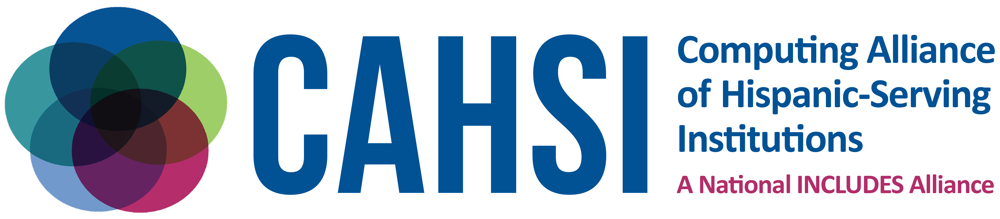

&nbsp;<picture>
  <source
    srcset=".github/images/stan-state_formal_full.png"
    media="(prefers-color-scheme: light), (prefers-color-scheme: no-preference)"
  />
  <source
    srcset=".github/images/stan-state_formal_white.png"
    media="(prefers-color-scheme: dark)"
  />
  
</picture>

# CAHSI Club Website at Stan State
> **Note**: This repository is no longer maintained. Future changes and maintenance will be handled by the [CAHSI Club at Stan State](https://hopper.csustan.edu/~cahsi/) directly.

This repository contains the source code for the CAHSI Club website at California State University, Stanislaus. The website is hosted on CSU Stanislaus' Hopper servers and can be found at [https://hopper.csustan.edu/~cahsi/](https://hopper.csustan.edu/~cahsi/).

## Built With
*  — Powerful, extensible, and feature-packed frontend toolkit.
*  — Fast, small, and feature-rich JavaScript library.
*  — The Internet's icon library and toolkit.

## License
This project is licensed under the MIT License - see the [LICENSE](LICENSE) file for details.

Original code by [Stephanie Gamboa](https://github.com/sgamboa01).
Updated and maintined by [August Frisk](https://github.com/4N0NYM0U5MY7H).
Files may contain third-party content that is subject to additional license terms specified in the files.
